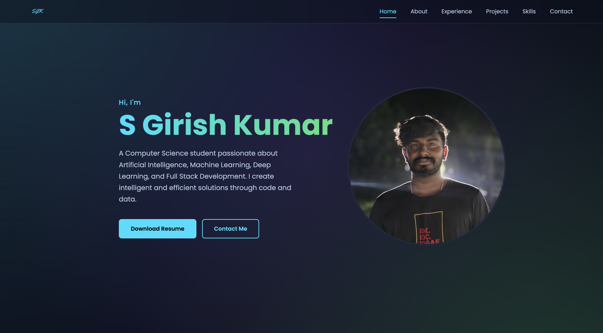

# S Girish Kumar - Personal Portfolio Website 🚀

[](https://sgirishkumar04.github.io/My-Portfolio-SGK/)
[](https://developer.mozilla.org/en-US/docs/Web/Guide/HTML/HTML5)
[](https://developer.mozilla.org/en-US/docs/Web/CSS)
[](https://developer.mozilla.org/en-US/docs/Web/JavaScript)

Welcome to the repository for my personal portfolio website. This project was built from scratch to serve as a central hub for my work. As a Computer Science student passionate about AI, Machine Learning, and Full Stack Development, this site showcases my skills, experience, and the projects I have built.

---

## 🌐 Live Demo & Screenshot

You can visit the live version of my portfolio, which is hosted on GitHub Pages:

### 👉 [https://sgirishkumar04.github.io/My-Portfolio-SGK/](https://sgirishkumar04.github.io/My-Portfolio-SGK/)



---

## 🛠️ Technology Stack

This portfolio is a static single-page application built with a focus on clean code, performance, and modern web standards.

-   **Frontend:**
    -   **HTML5:** For semantic content structure.
    -   **CSS3:** For all styling, layouts, and animations (using Flexbox, Grid, and CSS Variables).
    -   **Vanilla JavaScript (ES6+):** For all interactivity, including the navigation and contact modal.
-   **Deployment:**
    -   Hosted on **GitHub Pages**.
    -   Continuous deployment is handled automatically via **GitHub Actions**.
-   **Services & Tools:**
    -   **Web3Forms:** For the serverless "Say Hello" contact form.
    -   **Boxicons:** For the icon library.
    -   **Google Fonts:** For typography.

---

## 🚀 You can also create one like this

Feel free to use this project as a template to build your own portfolio.

1.  **Fork the repository** by clicking the 'Fork' button at the top-right of this page.

2.  **Clone your forked repository** to your local machine:
    ```sh
    git clone https://github.com/YOUR_USERNAME/My-Portfolio-SGK.git
    cd My-Portfolio-SGK
    ```
    *(Replace `YOUR_USERNAME` with your GitHub username.)*

3.  **Personalize the content:**
    -   Open `index.html` and edit the text with your own information (name, bio, projects, experience, etc.).
    -   Go to the `assets/` folder and replace the images, resume, and favicons with your own files.
    -   **Crucially:** Create your own free access key at [Web3Forms](https://web3forms.com/) and replace the existing `access_key` in the contact form to ensure you receive messages.
    -   Update all links (`<a>` tags) to point to your social profiles and live projects.

---

## 📫 Get In Touch

I'm always open to discussing new opportunities or collaborating on projects.

-   **Email:** [girishkumars2004@gmail.com](mailto:girishkumars2004@gmail.com)
-   **GitHub:** [@sgirishkumar04](https://github.com/sgirishkumar04)
